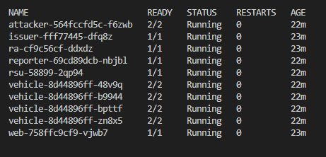
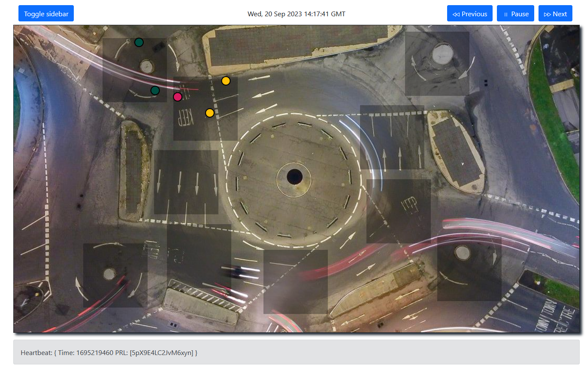

# Simulation of a V2X scenario with self-revocation

We implemented a simulated V2X scenario where vehicles communicate on an edge
area via broadcast messages. The infrastructure manages enrollment to the
network (via an Issuer) and revocation (via a Revocation Authority (RA)).

Simulations can run using either Docker Compose or Kubernetes. Below, we provide
instructions for running on a Kubernetes cluster.

## Short description of the application

This simulation has the purpose to evaluate our revocation scheme only. As such,
many parts of the V2X protocol (enrollment, pseudonym generation, etc.) are
greatly simplified. Instead, V2V communication is protected using pseudonym
identifier and digital signatures, similar to the current state of the art,
while revocation implements our scheme. Misbehavior detection, however, is also
simplified and only consists in reporting a pseudonym to the RA via an API, who
eventually manndates the revocation of the pseudonym once a certain number to
reports has been collected.

The simulation spawns a single edge area within which vehicles can "move". The area is divided in one or more groups, and movement consists in simply passing from one group to another. Vehicles in the same group are "close" to each other, and can communicate via multicast. As such, vehicles from different groups cannot communicate to each other.

Each component is implemented in Python, except for the TC which was implement
in Go. As the TC in the real worl should run in a trusted execution environment,
this allows running the TC in an Intel SGX enlave without code changes, using
the [EGo](https://www.edgeless.systems/products/ego/) framework. This, however,
requires proper hardware and is beyond the scope of our simulation.

See Section VII-A of our paper for more information.

## Prerequisites

We require a Linux-based operating system running a recent Linux distribution.
We tested our code on Ubuntu 22.04, but other recent distros should work as
well. Python 3 needs to be installed on the machine.

1. Install Python dependencies: `pip3 install -r scripts/requirements` 
    - We recommend using a [virtual environment](https://docs.python.org/3/library/venv.html)
2. Install [kubectl](https://kubernetes.io/docs/tasks/tools/install-kubectl-linux/)
3. Install `screen` (needed to run simulations in background): `sudo apt install screen`

## Kubernetes cluster setup

Here you can choose to run the application on an existing Kubernetes cluster or
to setup a local cluster, e.g., using
[Minikube](https://minikube.sigs.k8s.io/docs/).

### Existing cluster

If you have an existing cluster already running, make sure it is reachable via
`kubectl`.

All our Deployment specifications have a `nodeSelector` that ensures that pods
are only deployed on nodes with the `workerNode: "yes"` label. Therefore, make
sure to either (1) set a label to each node you want to use for the application
using the `kubectl label nodes` command, or (2) remove the node selector from
the specifications in `res`.

**NOTE 1:** Our application uses multicast for communication between
vehicles. However, not all Kubernetes network plugin support this feature. In
order to run our application correctly, make sure your network plugin supports
multicast. As far as we know,
[Calico](https://docs.tigera.io/calico/3.25/reference/faq#can-calico-do-ip-multicast)
*does not* support multicast, but [Weave
net](https://www.weave.works/docs/net/latest/install/) does.

**NOTE 2:** To compute average revocation times shown in our paper, each
component logs to a file each action performed (with a timestamp). These files
are automatically collected by our scripts after the simulation ends. Our
scripts assume that all K8s nodes and the host share a volume, where logs will
be stored. This volume can be specified by setting the `LOG_DIR_MOUNT` and
`LOG_DIR_LOCAL` variables in the Makefile. If, however, there is no such shared
volume, logs must be collected separately for each pod and put under
`LOG_DIR_LOCAL` before calling `log_aggregator.py`.

### Minikube

Our application can be easily deployed locally using Minikube, which is a tool
that sets up a local fully-configured Kubernetes cluster with only one node. Our
scripts and Makefile should support such a deployment without requiring any
changes.

To set up a minikube cluster, first make sure
[Docker](https://docs.docker.com/engine/install/ubuntu/) is correctly installed
(you can verify this by running `docker run --rm hello-world`). Then, [install
Minikube](https://minikube.sigs.k8s.io/docs/start/).

Then, run `make run_minikube` to start the Minikube instance and set up the
node.

## Test

The [.env](./.env) file contains a list of all configurable parameters. Almost
all parameters do not need to be changed, if not desired. A detailed explanation
of each parameter can be found [below](#parameters).

To test if the application works correctly, we will instantiate a deployment
with only 5 vehicles, one of which malicious. The current `.env` file is already
configured as such, and is set to divide the vehicles in two groups. The default
value for `T_V` is set to 30 seconds, as used in our paper (Sect. VII-A).

### Deploy application

The commands below assume that you followed the prerequisites and that a
Kubernetes cluster is already running and correctly configured (see above).

```bash
# Clean up resources from earlier runs, just to be sure
make clean

# Deploy application -- this will use the parameters specified in the .env file
make run_kubernetes
```

The `run_kubernetes` command sets up a `v2x` namespace and configure environment
variables and other resources. After that, it deploys the application in order:
firstly, the infrastructural components `issuer`, `ra`, `rsu` and `web`;
secondly, `reporter` and the vehicles `vehicle` and `attacker`. In the first
run, it may take some time to deploy all containers (the nodes need to pull all
the container images). If everything goes well, eventually all the pods should
reach the `Running` state:

```bash
# Check state of pods: they should go to the `Running` state eventually
kubectl -n v2x get pods
```



### Use the web interface

A visual representation of the simulation is provided by the `web` component,
which runs a web server on port 80. This is a pretty simple web app that is only
intended for demonstrative purposes, and for best results it is recommended to
not exceed 30-40 virtual vehicles and 10 groups in total, and no more than 16
vehicles per group on average. The web application can be exposed locally on
port 8080 via the `make port_forward` command:

```bash
# Expose the web interface locally on port 8080
make port_forward
```

Now open the browser and go to http://localhost:8080. You should be able to see
our V2X dashoard that shows the current map, similar to the picture below. 



Each circle represents a _pseudonym_, and can have different colors:
- Green: honest (i.e., belonging to a "honest" vehicle)
- Yellow: victim (i.e., belonging to a "honest" vehicle, but under the influence
  of an attacker)
- Red: malicious (i.e., belonging to a "attacker" vehicle) 

Shaded rectangles show different groups, in our case only two of them should
contain pseudonyms.

Even if we deployed only 5 vehicles, you may see more than 5 circles in the map,
because the map shows _pseudonyms_ ant not vehicles: In fact, in our
configuration each vehicle has two concurrent pseudonyms. Our map simulates a
_passive observer_ that can only see network messages but cannot infer which
pseudonym belongs to which vehicle.

The web interface shows the situation of the application each second, and allows
pausing or going back to a previous time frame. Additionally, pseudonyms can be
manually reported (and consequently _revoked_) by simply clicking on the circles
in the map.

**NOTE:** If you cannot see any circles even though the application seems
running normally (i.e., all pods are in a `Running` state), it is most likely
due to multicast/broadcast issues in your network configuration, preventing
vehicles (and the `web` component) to send/receive multicast messages. This can
be confirmed by inspecting the logs of any `vehicle` pod (using `kubectl -n v2x
logs <vehicle_pod_name> tc`): If you can see one or more `SIGN` events but no
`VERIFY` events, it is most likely due to multicast not working. Unfortunately,
there is no straightforward solution for this, but you can try changing your
Kubernetes network plugin or restarting your Minikube cluster.

### Clean up

To shut down the application, simply run `make clean` again and the `v2x`
namespace will be deleted along with all its resources.

## Reproduce our results

To reproduce the results of our paper, we ran several simulations. Each
simulation ran for ~2 hours and spawned 360 "honest" vehicles and 40 "malicious"
vehicles, and each used a different set of parameters for `T_V`, and
`TRUSTED_TIME` (see [below](#parameters) for more info on these parameters).

The table below, analogously to Table III in Appendix B, summarizes the setup of
each scenario of the simulation:

| Scenario     | Link to paper       | Parameters                   |
| Scenario A1  | Fig. 5, Sect. VII-A | `T_V=30`, `TRUSTED_TIME=0`   |
| Scenario A2  | Fig. 12, Appendix B | `T_V=150`, `TRUSTED_TIME=0`  |
| Scenario A1  | Fig. 13, Appendix B | `T_V=30`, `TRUSTED_TIME=1`   |
| Scenario A1  | Fig. 14, Appendix B | `T_V=150`, `TRUSTED_TIME=1`  |

Additionally, each scenario ran four different simulations, each using a
different attacker level. See Sect VII-A of our paper for more information on
attacker levels.

### Configure simulations

We provide scripts to completely automate the simulations. The
[simulation.yaml](./simulation.yaml) can be used to describe the simulations to
run, and can be customized according to one's needs. The `scenarios` list sets
up the correct parameters for each scenario, while the `runs` list describes the
simulations to run, associating them to each scenario.

The file is already configured with the correct parameters for each
run/scenario. However, you can customize the number of vehicles and groups in
each scenario according to your preference and (especially) your hardware.

In our setup, we ran 400 vehicles over 8 nodes, which is infeasible if running
the cluster locally on one single node, e.g., with Minikube. However, the
simulation can be scaled down according to your available resources, while still
getting meaningful results.

The "single" components of our application (e.g., `issuer`, `ra`, etc.) in total
use `825` millicores and `288` MiB of memory, while each vehicle (honest or not)
requires `75` millicores and `96` MiB of memory. For a commodity desktop machine
with a x86-64 CPU with 8 cores and 16 GB of RAM, it would be _theoretically_
possible to run ~98 vehicles, but we highly recommend staying between 20-50
vehicles in total (i.e., `NUM_VEHICLES` + `NUM_ATTACKERS`).

### Run simulations

Below, we describe the commands to run one or more simulations. Make sure your
cluster is up and running, and the `simulation.yaml` file is configured
correctly.

Simulations can be executed via the `make run_simulations` command, which runs a
script in foreground that manages each simulation automatically. Alternatively,
the `make run_simulations_background` command runs the script in the background
using the `screen` tool. Simulation times can be defined by passing as input to
the targets `SIM_TIME`, expressed in seconds. Additionally, `DOWN_TIME`
specifies the time needed to shut down the application, and is used to prevent
bias when gathering the data.

The more each simulation runs, the more data is gathered. Although we ran each
simulation for around 2 hours, this is not necessary for reproducing our
results. However, we highly recommend setting simulation times no less than
10-20 minutes for each simulation.

To run only simulations from a specific scenario, you can set the `SCENARIO`
variable in the `make run_simulations` command. This is useful if, for example,
you want to reproduce only the results of the main paper (i.e.,
`SCENARIO=scenario-a1`). Additionally, setting `RUN` will restrict the
simulations to a specific run.

When running simulations, we recommend using `run_simulations_background` such
that you do not have to keep your shell (or SSH connection) open the whole time.
The script will continue to run on a separate `screen` session until the end.

```bash
# Clean up resources from earlier runs, just to be sure
make clean

# Test - run only the first simulation for 2 minutes to ensure everything works
# Wait until the end -- after a couple of minutes, the scripts should
make run_simulations SCENARIO=scenario-a1 RUN=1-honest SIM_TIME=120 DOWN_TIME=30
```

### Plotting results

Results of simulations are automatically computed from application logs, and
shown under `simulations/`. A separate `make plot` command can be used for
plotting results.

```bash
# Plot results of scenario 1
# NOTE: the `PLOTS` variable specifies the attacker levels that will appear in the plot
#       This assumes that a simulation for each attacker level has been run
make plot SCENARIO=scenario-a1 PLOTS=honest,smart,blind,smart-prl

# Plot all results (assuming that all simulations for all scenarios have been run correctly)
make plot_all
```

_A note on results:_ It is rather unlikely that you will reproduce _exactly_ the
results in our paper. Of course, "effective" revocation times are subject to a
large number of factors, including some randomness (e.g., the RSU that randomly
drops/delay heartbeats, the reporter that randomly replays V2V messages, etc.).
You should however be able to see _similar_ results. In any case, you should
notice that *none* of the values in the box plots goes after the `T_eff`
threshold: this is guaranteed by our formal verification work (see Sect. VI).

We provide reference outputs from our simulations that can exactly reproduce the
plots in the paper. These are shown under
[reference-outputs](./reference-outputs). Plots can be recomputed by running the
command below.

```bash
# Recompute plots from reference outputs
make plot_all SIM_DIR=reference-outputs/
```

## Parameters

Note: booleans must be represented with either `0` (false) or `1` (true)

### General parameters

| Parameter                    | Type       | Description                                                        |
|------------------------------|------------|--------------------------------------------------------------------|
| `VERSION`                   | string      | App version (latest: `v1.0.2`)                                     |
| `LOG_LEVEL`                 | string      | Log level of the application                                       |
| `LOG_TO_FILE`               | boolean     | write logs to a file under `/logs`                                 |
| `LOG_TO_UDP`                | boolean     | broadcasts functional logs to UDP. Needed by the `web` component   |
| `LOG_MAX_SIZE`              | int         | optionally indicates a maximum size of each log file, in MB        |

### System parameters

| Parameter                    | Type       | Description                                                        |
|------------------------------|------------|--------------------------------------------------------------------|
| `T_V`                        | int        | Validity window for heartbeats and V2V messages (See Sect. V)      |

### Vehicles, attackers and groups

| Parameter                    | Type       | Description                                                        |
|------------------------------|------------|--------------------------------------------------------------------|
| `NUM_VEHICLES`              | int         | Number of honest vehicles that will be spawned                     |
| `NUM_ATTACKERS`             | int         | Number of malicious vehicles that will be spawned                  |
| `ATTACKER_LEVEL`            | string      | attacker level for malicious vehicles (see Sect. VII-A)            |
| `NUM_GROUPS`                | int         | Number of groups within an area to simulate proximity (Sect VII-A) |

The attacker level defines how the OBU process heartbeats received from network,
and different levels simulate different classes of attackers. See Sect. VII-A
for more information.

### Pseudonyms

| Parameter                    | Type       | Description                                                        |
|------------------------------|------------|--------------------------------------------------------------------|
| `NUM_PSEUDONYMS`            | int         | Max. number of concurrent pseudonyms that a vehicle can have       |
| `PSEUDONYM_SIZE`            | int         | size of a pseudonym identifier, in bytes                           |
| `PSEUDONYM_REFRESH_PERIOD`  | float       | Period of pseudonym rotation requested by the OBU, in seconds      |
| `MIN_PSEUDONYM_LIFETIME`    | int         | Min. lifetime of a pseudonym (enforced by the TC), in seconds      |

While `PSEUDONYM_REFRESH_PERIOD` is used by the OBU to request pseudonym
rotation to the TC, the latter can deny this request if the pseudonym to rotate
has not yet reached its minimum lifetime `MIN_PSEUDONYM_LIFETIME`. This is done
to prevent malicious OBUs to frequently rotate pseudonyms, which can be
indication of Sybil attacks. To be implemented securely on a real-world
scenario, however, either the TC needs a trusted time source or the minimum
pseudonym lifetime must be enforced by the infrastructure (e.g., the Issuer).

### Network messages

| Parameter                        | Type       | Description                                               |
|----------------------------------|------------|-----------------------------------------------------------|
| `HEARTBEAT_DISTRIBUTION_PERIOD`  | float      | Period of hearbeat broadcast done by the RSU              |
| `HEARTBEAT_GENERATION_PERIOD`    | float      | Period of heartbeat generation done by the RA             |
| `V2V_GENERATION_PERIOD`          | float      | Period of generation of V2V messages done by vehicles     |

`HEARTBEAT_GENERATION_PERIOD` influences the frequency with which the RA
generates a new heartbeat (from current PRL and timestamp), the RSU then fetches
the most recent heartbeat with period `HEARTBEAT_DISTRIBUTION_PERIOD`. The RA
itself does not distribute heartbeats, but exposes an HTTP endpoint from which
they can be collected by the RSU.

### TC parameters

| Parameter                    | Type       | Description                                                                             |
|------------------------------|------------|-----------------------------------------------------------------------------------------|
| `TRUSTED_TIME`               | boolean    | enable/disable local trusted time source in TCs                                         |
| `TC_STORE_LAST_PRL`          | boolean    | enable/disable active revocation (see Sect. VI-B and VII-A)                             |
| `HARD_REVOCATION`            | boolean    | Upon self-revocation, delete all credentials (true) or only the ones in the PRL (false) |

`HARD_REVOCATION` should be enabled by default for security. If not, revoked
vehicles will continue to operate if they still have other valid pseudonyms. 

### OBU parameters 

| Parameter                    | Type       | Description                                                                        |
|------------------------------|------------|------------------------------------------------------------------------------------|
| `JOIN_MAX_DELAY`             | int        | set a maximum delay when joining the network                                       |
| `AUTO_REJOIN`                | boolean    | re-join the network automatically after revocation                                 |
| `BLIND_ATTACKER_DROP_RATE`   | float      | parameter only used by the blind-1 attacker                                        |
| `BLIND_2_ATTACKER_DELAYED`   | boolean    | parameter only used by the blind-2 attacker                                        |
| `VEHICLE_MOVING`             | boolean    | If "1" (true), vehicles can move between groups                                    |
| `RANDOM_MOVEMENT`            | boolean    | decides whether vehicle follows ordered movement (1->2->3) or random (1->9->4)     |
| `MOVEMENT_PERIOD`            | int        | period of movement, in seconds                                                     |

`JOIN_MAX_DELAY` prevents vehicles from joining all at the same time when the
application starts. A random delay between 0 and `JOIN_MAX_DELAY` is computed
when the OBU is initialized.

`AUTO_REJOIN` allows OBUs to re-join the network when their TC gets revoked.
While this should be prevented by the infrastructure in a real-world scenario,
it allows us to maintain a constant number of vehicles in the simulation.

Movement of vehicles is simulated by just changing group to which send/receive
V2V messages. This movement can be ordered (e.g., from group 1 to 2 and from
group 2 to 3) or random. Besides, vehicles move with a predefined period of
time.

`BLIND_ATTACKER_DROP_RATE` and `BLIND_2_ATTACKER_DELAYED` influence the
heuristics of the `blind-1` and `blind-2` attackers, respectively. Attacker
levels define how the OBU process heartbeats received from network, and simulate
different classes of attackers. See Sect. VII-A for an intuition of the `blind`
attacker level. The logic of the different attacker levels can be found
[here](src/vehicle/obu/attacker.py).

### RSU parameters

| Parameter                    | Type       | Description                                             |
|------------------------------|------------|---------------------------------------------------------|
| `RSU_DROP_RATE`              | float      | probability to drop a heartbeat                         |
| `RSU_DELAY_RATE`             | float      | probability to delay a heartbeat (with random delay)    |

To simulate network malfunctions, these two parameters can be specified so that
the RSU from time to time fails to broadcast heartbeats (either by dropping or
delaying them).

The probabilities to success, delay and drop must sum up to 1. For example,
setting `RSU_DROP_RATE` to 0.2 and `RSU_DELAY_RATE` to 0.3 means that each
heartbeat has:
- 20% chance of getting dropped
- 30% chance of getting delayed
- 50$ chance of getting broadcast correctly and without delays

### Reporter parameters

| Parameter                    | Type       | Description                                                    |
|------------------------------|------------|----------------------------------------------------------------|
| `REPORT_MALICIOUS_ONLY`      | boolean    | decides whether to report all vehicles or attackers only       |
| `REPORT_PERIOD`              | float      | reporting period, in seconds                                   |
| `REPLAY_RATE`                | float      | probability to replay a malicious message                      |

The reporter is responsible for reporting pseudonyms to the RA, which in turn
will mandate revocation of such pseudonyms. If `REPORT_MALICIOUS_ONLY` is set,
the reporter will only report pseudonyms belonging to malicious vehicles (the
"attacker" pods). 

Additionally, the reporter can also replay malicious messages that are received
from the network, with a certain probability defined by `REPLAY_RATE`. This is
used to simulate replay attacks, where attackers send the same malicious message
more than once.

### Webapp parameters

| Parameter                    | Type       | Description                                                                     |
|------------------------------|------------|---------------------------------------------------------------------------------|
| `THRESHOLD_MALICIOUS`        | int        | Minimum time to define a pseudonym "victim" of an attacker, in seconds          |
| `THRESHOLD_UNSEEN`           | int        | Minimum time to define a pseudonym "unseen" and remove from map, in seconds     |
| `THRESHOLD_UNUSED`           | int        | Minimum time to define a pseudonym "unused" and delete from memory, in seconds  |

The web application places all pseudonyms on a map, according to the group to
which they belong.

If a pseudonym is malicious, it is shown in red. All pseudonyms that have
processed malicious messages in the last `THRESHOLD_MALICIOUS`  seconds are
instead shown in yellow.

Pseudonyms that are not used for a certain time `THRESHOLD_UNSEEN` are hidden
from the map, and after `THRESHOLD_UNUSED` they are deleted from memory.